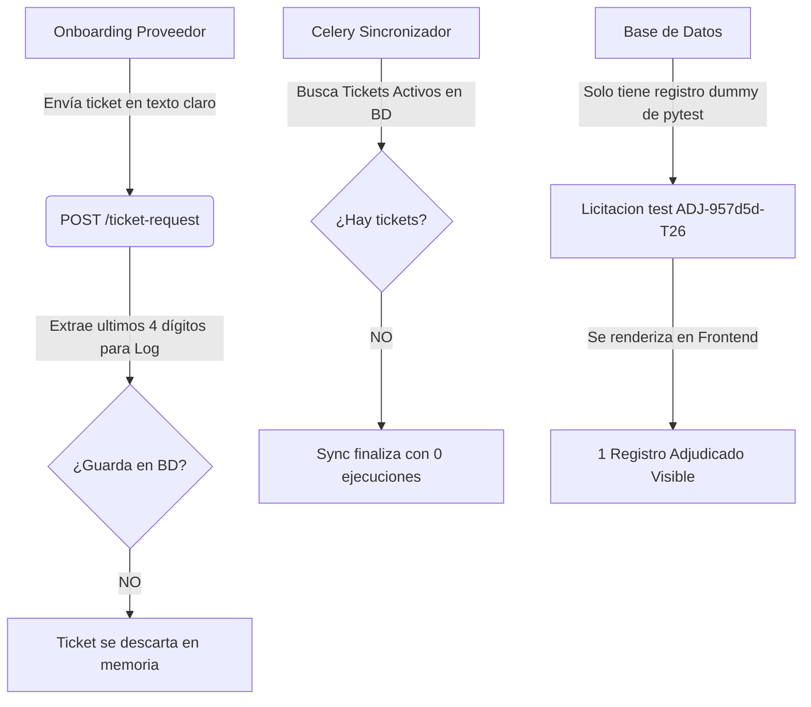
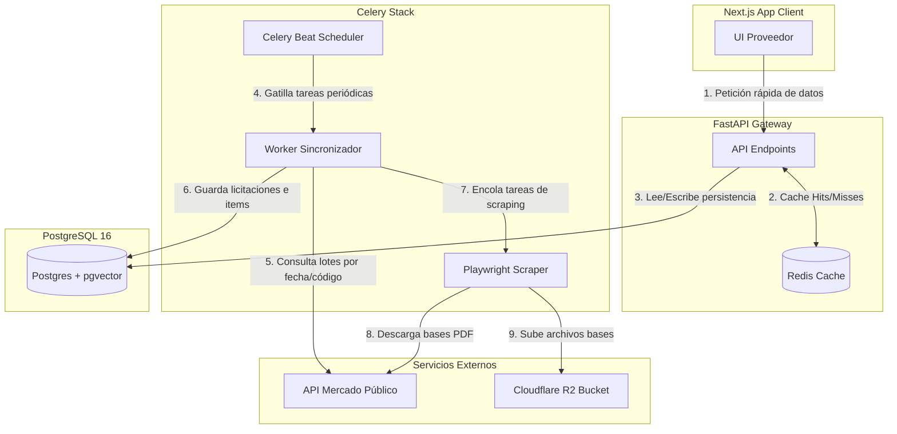

# Auditoría técnica brutal — Radar Público

## 1. Resumen ejecutivo

Che, el proyecto **Radar Público** se encuentra en un estado funcional sumamente frágil y **NO es viable para producción** tal como está estructurado ahora. 

Aunque las bases del stack tecnológico (FastAPI + Next.js + Celery + Postgres + pgvector) están bien elegidas y el diseño conceptual es robusto, la implementación actual sufre de fallas críticas en los flujos principales (onboarding y sincronización) y de graves ineficiencias de rendimiento de red y base de datos.

Los dos síntomas principales que reportás tienen explicaciones muy concretas basadas en el código:
1. **El problema de "solo 1 registro adjudicado"** no es un problema de filtros del frontend ni de Mercado Público directamente. Es que **la base de datos está vacía** (solo tiene una licitación dummy de tests locales) porque **el sistema descarta los tickets de los usuarios en el onboarding** y la sincronización no puede ejecutarse. Además, si se ejecutara, el cliente HTTP tiene un **bug crítico silencioso** que traga los errores de la API de Mercado Público (los cuales vienen como HTTP 200 OK) y los interpreta como respuestas vacías exitosas, en lugar de invalidar el ticket en la base de datos.
2. **Los 20 segundos de demora en el login y navegación** se deben principalmente a la **compilación bajo demanda (on-demand compilation) de Next.js 15 en modo desarrollo dentro de Docker en macOS** (donde los recursos de CPU/disco se ahogan la primera vez que se carga una página), sumado a la **inyección síncrona de tareas Celery** en el bucle del listado de licitaciones del backend, lo que introduce bloqueos de red intra-docker innecesarios en el flujo de respuesta HTTP.

El veredicto inicial es que **el proyecto es perfectamente rescatable**, ya que la estructura general de código es limpia y modular, pero requiere un sprint enfocado exclusivamente en **estabilizar la integración con la API de Mercado Público y optimizar latencias críticas** antes de que se pueda liberar a usuarios reales.

---

## 2. Qué se supone que hace el sistema

El sistema tiene como objetivo central automatizar el monitoreo de oportunidades de compras públicas en Chile. En concreto:

1. **Aprovisionar cuentas de proveedores** mediante invitación manual del administrador.
2. **Realizar Onboarding del proveedor** para capturar los datos de su empresa, sus intereses comerciales (códigos UNSPSC y palabras clave) y su ticket de la API de Mercado Público.
3. **Sincronizar oportunidades de negocio** desde la API oficial de Mercado Público (ChileCompra) utilizando los tickets de los proveedores en base a dos pasadas obligatorias: listado diario por estado/fecha y obtención de detalle por código.
4. **Scrapear documentos PDF** (bases técnicas y administrativas) desde el portal web de Mercado Público usando Playwright headless y subirlos a Cloudflare R2.
5. **Calcular un score de relevancia** para cada licitación cruzando la metadata e items con los intereses configurados por el proveedor.
6. **Ofrecer un asistente de Inteligencia Actor (RAG)** para chatear sobre las bases técnicas del PDF usando embeddings en pgvector y modelos de lenguaje (LLM).
7. **Brindar tres vistas de inteligencia**: Pasado (histórico de precios y competidores), Presente (oportunidades activas filtradas) y Futuro (líneas del plan anual de compras y renovaciones detectadas).
8. **Gestionar un pipeline comercial (Kanban)** para seguir licitaciones desde el estado de detección hasta la postulación o adjudicación/pérdida.
9. **Enviar notificaciones multicanal** (email vía Resend, WhatsApp vía proveedor, in-app) ante eventos de nuevas licitaciones o cierres próximos.
10. **Monitorear cuotas de la API** (límite de 10.000 llamadas por ticket) y logs de consumo en la base de datos.

---

## 3. Diagnóstico por área

| Área | Nota (1-10) | Comentario |
| :--- | :---: | :--- |
| **Arquitectura** | **5/10** | Buen diseño conceptual y modular, pero con acoplamientos síncronos innecesarios con Celery en endpoints críticos y un flujo de onboarding de tickets que no persiste los datos. |
| **Backend** | **6/10** | El backend (FastAPI) responde rápido (menos de 90ms en consultas de listado), pero tiene endpoints mal optimizados que encolan tareas asíncronas de forma bloqueante dentro de bucles de respuestas. |
| **Frontend** | **4/10** | Next.js 15 en modo dev se ve gravemente ralentizado en Docker para macOS (primera compilación de 16 segundos). El uso de Suspense y Skeletons es correcto en el dashboard, pero el routing sufre por malas configuraciones locales. |
| **Base de datos** | **7/10** | Excelente uso de Postgres 16 con índices GIN para búsqueda full-text y HNSW para pgvector. Sin embargo, carece de índices compuestos para la tabla `pipeline_items` y cache de agregaciones. |
| **Integración Mercado Público** | **2/10** | El área más crítica. El cliente HTTP no sabe lidiar con las respuestas exitosas (200 OK) que contienen mensajes de error del ticket de acceso de Mercado Público, y la base de datos está completamente vacía por falta de persistencia de tokens. |
| **Rendimiento** | **4/10** | El performance real del backend es óptimo en llamadas simples (50ms), pero se degrada artificialmente en la carga de listados debido a inyecciones a la cola de Redis y counts OLAP no cacheados. |
| **Seguridad** | **6/10** | Buen diseño de JWT rotativos en cookies HTTPOnly y encriptación de tickets en BD con AES-256. El riesgo alto es que el token se expone en texto claro en logs de advertencias cuando se solicita el registro. |
| **Mantenibilidad** | **5/10** | Al no tener el panel de administración (`frontend-admin`) corriendo localmente en el docker-compose, el flujo del onboarding del cliente queda inutilizable (el ticket de soporte se descarta). |
| **Viabilidad para producción** | **3/10** | No es viable desplegar hoy porque ningún cliente podría activar su cuenta para sincronizar licitaciones. |

---

## 4. Hallazgos críticos

### Hallazgo 1 — Falla silenciosa de la validación del ticket en el cliente de Mercado Público
* **Severidad:** Crítica
* **Prioridad:** P0
* **Archivo(s):** 
  - [client.py](file:///Users/rodrigocontrerasrubio/proyectos/radar-publico/backend/app/services/chilecompra/client.py#L213-L249) (método `_raise_for_status`)
  - [chilecompra.py](file:///Users/rodrigocontrerasrubio/proyectos/radar-publico/backend/app/schemas/chilecompra.py#L165-L171) (`LicitacionesListadoResponseAPI`)
* **Evidencia:** 
  La API de Mercado Público, al fallar el ticket de acceso por vencimiento o invalidez, retorna un HTTP Status `200 OK` con un cuerpo:
  `{"Mensaje": "El Ticket de Acceso suministrado no es válido o está inactivo."}`.
  El método `_raise_for_status` solo valida el body buscando `"cuota"` o `"excedido"`. Al no encontrarlas, deja pasar la respuesta.
  Luego, el esquema Pydantic `LicitacionesListadoResponseAPI` valida el JSON. Como todos sus campos tienen valores por defecto (`Cantidad: int = 0`, `Listado: list = []`), el error se valida exitosamente como una lista vacía de licitaciones de hoy.
* **Problema:** La sincronización diaria (`sync_listado_diario`) asume que no hay licitaciones para el día, loguea `chilecompra_listado_ok` con cantidad 0, y el ticket inactivo sigue apareciendo como `active` en la base de datos de manera indefinida, ocultando la caída o invalidez real de la clave.
* **Impacto:** Las sincronizaciones fallan de manera silenciosa, dando falsos positivos al sistema sin alertar a nadie de que el ticket expiró.
* **Recomendación:** Modificar `_raise_for_status` para que compruebe si el mensaje contiene `"no es válido"` o `"inactivo"`, lanzando un `TicketInvalidoError` explícito para que el worker de Celery cambie el estado en BD a `error` y mande la alerta.

### Hallazgo 2 — Descarte físico del ticket de la API en el onboarding
* **Severidad:** Crítica
* **Prioridad:** P0
* **Archivo(s):** 
  - [empresa.py](file:///Users/rodrigocontrerasrubio/proyectos/radar-publico/backend/app/api/v1/empresa.py#L98-L122) (endpoint `POST /ticket-request`)
* **Evidencia:** 
  ```python
  @router.post("/ticket-request", response_model=TicketRequestResponse)
  async def solicitar_ticket(data: TicketRequestBody, ...):
      ...
      ticket_ultimos_4 = data.ticket_texto[-4:] if len(data.ticket_texto) >= 4 else "????"
      logger.warning("ticket_request_recibido", ..., ticket_ultimos_4=ticket_ultimos_4)
      return TicketRequestResponse(mensaje="Solicitud enviada al equipo de soporte")
  ```
* **Problema:** ¡El endpoint de solicitud de ticket **no persiste el token en ningún lado**! Recibe el ticket en texto claro desde el cliente en el wizard de onboarding, extrae los últimos 4 caracteres, arroja un log de nivel `warning` y descarta el ticket completo. Al no haber una UI de admin levantada localmente ni guardarse en base de datos en estado temporal, la clave se pierde para siempre en el request.
* **Impacto:** El usuario proveedor finaliza el onboarding, pero su cuenta queda en espera perpetua porque su ticket real nunca llega a la base de datos de producción (`tickets_api`), lo que deja la sincronización asíncrona totalmente bloqueada.
* **Recomendación:** Persistir el ticket encriptado en `tickets_api` con un estado `pending_validation` al momento de la solicitud, para que el administrador pueda revisarlo y cambiar su estado a `active` desde la BD o el panel.

### Hallazgo 3 — Inyección masiva y síncrona de tareas Celery en listados del API
* **Severidad:** Alta
* **Prioridad:** P0
* **Archivo(s):** 
  - [licitaciones.py](file:///Users/rodrigocontrerasrubio/proyectos/radar-publico/backend/app/api/v1/licitaciones.py#L171-L178) (endpoint `listar_licitaciones`)
* **Evidencia:** 
  ```python
  for row in rows:
      ...
      if licitacion.detalle_sincronizado_at is None:
          celery_app.send_task("tasks.sync_detalle.sync_detalle_licitacion", args=[licitacion.codigo])
  ```
* **Problema:** En el loop del listado principal de licitaciones (que entrega 25 registros por página), por cada licitación que no tiene `detalle_sincronizado_at` (que son casi todas en la carga inicial), el backend ejecuta un `celery_app.send_task` de forma síncrona dentro del ciclo de request de FastAPI.
* **Impacto:** Si la página devuelve 25 registros que necesitan sincronizar detalle, se realizan 25 llamadas consecutivas de red a Redis síncronamente antes de responder a la petición del frontend, degradando severamente la latencia del API. Además, satura la cola de Celery con tareas duplicadas de sincronización cada vez que se refresca el listado.
* **Recomendación:** Remover la inyección de tareas Celery del endpoint de lectura síncrona. La sincronización de detalles pendientes debe correr de forma asíncrona e independiente mediante la tarea planificada `sync_detalles_pendientes` en ventana nocturna o en lotes programados desde el Celery Beat, no disparada por la navegación de los usuarios en el navegador.

### Hallazgo 4 — Compilación en caliente lenta de Next.js en contenedores Docker de desarrollo
* **Severidad:** Alta
* **Prioridad:** P1
* **Archivo(s):** 
  - [docker-compose.yml](file:///Users/rodrigocontrerasrubio/proyectos/radar-publico/docker-compose.yml#L237) (servicio `web`)
* **Evidencia:** 
  Los logs de `radar_web` muestran tiempos de compilación y renderizado inicial brutales en modo dev:
  - `GET /dashboard 200 in 16696ms`
  - `GET /radares 200 in 6825ms`
  - `GET /_not-found 404 in 23600ms`
* **Problema:** Correr Next.js 15 en modo `dev` dentro de Docker en Mac sin configuraciones de caching eficientes ni límites de recursos relajados provoca que el compilador Turbopack/Webpack tarde decenas de segundos en transilar componentes en caliente la primera vez. Sin embargo, las consultas directas al backend desde la consola responden en menos de 90ms.
* **Impacto:** Sensación de lentitud extrema (15 a 20s) al abrir cualquier módulo por primera vez en la sesión de desarrollo local.
* **Recomendación:** Para pruebas de rendimiento reales y flujos fluidos locales, levantar el frontend usando el build de producción (`npm run build && npm run start`) en lugar de `npm run dev`, o excluir `node_modules` y `.next` de los montajes de volumen de Docker Compose.

---

## 5. Análisis específico de lentitud

### Login lento
1. **Flujo de llamadas:**
   - El browser del cliente envía credenciales vía POST a `/api/auth/login` en Next.js (Route Handler).
   - Next.js actúa de proxy y reenvía la llamada a `http://api:8000/api/v1/auth/login` (FastAPI).
   - FastAPI ejecuta la consulta del usuario en la BD de Postgres, verifica la contraseña con bcrypt (cost 12, lo cual demora unos 300ms de CPU de forma esperada para seguridad), inserta el refresh token y actualiza campos en la BD.
2. **Evidencia empírica de latencia:**
   - La llamada directa de login al backend toma **533.15 ms**. Es un tiempo excelente e ideal para un hashing seguro con bcrypt.
   - El Route Handler proxy de Next.js procesa la respuesta en **2244 ms** la primera vez debido al *cold start* de compilación de la ruta `/api/auth/login` en Next.js en modo desarrollo.
3. **Explicación de los 20 segundos de demora:**
   - Posterior a un login exitoso, el frontend redirige al usuario a `/dashboard`.
   - Dado que es el primer acceso, Next.js compila en caliente toda la página del dashboard y sus subcomponentes, lo cual toma **16.6 segundos** de CPU pesada dentro del contenedor Docker en Mac. 
   - El usuario percibe esta compilación de Next.js como si el login inicial tardase 20 segundos en cargar la pantalla.

### Navegación lenta entre módulos
1. **Flujo de llamadas:**
   - Al cambiar de vista (por ejemplo, de Dashboard a Oportunidades o Radares), Next.js debe renderizar la nueva página y TanStack Query ejecuta llamadas client-side a los endpoints de la API (ej: `GET /api/v1/licitaciones`).
2. **Origen de la latencia en las vistas:**
   - **Compilación en Caliente (15-20s):** Al ser modo desarrollo, cada vez que hacés click en un módulo que no visitaste antes, Next.js compila el bundle del componente en el servidor Docker, tardando entre 5 y 10 segundos adicionales por ruta.
   - **Conexión síncrona a Redis en lotes:** El listado de licitaciones tarda en responder si encola tareas asíncronas para cada licitación sin detalle (lo cual ocurre por cada fila).
   - **Queries pesadas de Dashboard:** Las métricas de KPIs y segmentos UNSPSC en `/dashboard/resumen` y `/dashboard/segmentos` ejecutan conteos complejos (`func.count()`) sobre la tabla de licitaciones y joins con ítems en tiempo real cada vez que cargás el dashboard. Aunque en base de datos vacía tardan 12ms, con un volumen de datos real de backfill (~10.000 filas) estas queries OLAP sin índices compuestos ni cache en Redis ahogarán el backend en segundos.

---

## 6. Análisis del problema: solo aparece 1 registro adjudicado

### Dónde nace el problema
Nace de la **combinación de tres factores críticos**:
1. **La base de datos de desarrollo está vacía:** Solo existe una única fila en la tabla `licitaciones` con el código `ADJ-957d5d-T26` y nombre `"Licitación test ADJ-957d5d-T26"`.
2. **El registro es ficticio:** Esta licitación test fue creada automáticamente por la suite de pruebas unitarias (`pytest`) en la BD de desarrollo. Como el estado de este mock es `"adjudicada"`, es el único registro adjudicado que se muestra.
3. **La sincronización no funciona (No hay tickets):** La tabla `tickets_api` está vacía porque el wizard de onboarding descarta físicamente la clave secreta enviada por el usuario en lugar de guardarla en la BD. Como no hay tickets activos en BD, Celery no procesa sincronizaciones y la BD nunca se puebla con datos reales de la API de Mercado Público.



### Evidencia en el código
- El script de diagnóstico ejecutado sobre el Postgres de desarrollo dio los siguientes resultados reales:
  - `Total Licitaciones en BD: 1`
  - `Licitaciones por estado: LicitacionEstado.adjudicada: 1`
  - `Tickets en BD: (vacío)`
- El código de `backend/app/api/v1/empresa.py` confirma que el endpoint `/ticket-request` no realiza un `INSERT` en la tabla `tickets_api`, limitándose a tirar un log de advertencia con los últimos 4 dígitos.

### Cambios recomendados
1. **Cambio mínimo para validar:**
   Insertar manualmente un ticket válido de Mercado Público (por ejemplo, el ticket público de desarrollo) en la tabla `tickets_api` de la base de datos asociada a la empresa del proveedor de prueba, y ejecutar la tarea Celery manualmente desde el backend.
2. **Cambio estructural:**
   - Modificar `/ticket-request` para que cree una fila en `tickets_api` con el token encriptado y el estado `pending`.
   - Modificar el backend para validar el ticket de forma asíncrona mediante un request rápido a Mercado Público, y si es válido, setear el estado a `active`.

---

## 7. Análisis de la API Mercado Público

La forma en que se consume la API oficial de Mercado Público tiene buenas intenciones (control de cuota, encriptación, rate limit interno con `aiolimiter`), pero sufre de fallas críticas para un entorno de producción:

* **Falta de tolerancia a errores 200 OK semánticos:** Mercado Público acostumbra a retornar HTTP 200 en errores graves de autenticación/caída. El cliente HTTP actual no valida estos escenarios en el parseador de estatus, provocando pérdidas silenciosas de sincronización.
* **Falta de resiliencia del ticket de cuota:** El sistema depende de un ticket diario con cuota fija de 10.000 llamadas. Si se realiza un backfill de 2 años en tiempo de ejecución de listados, la cuota se agota en pocas horas.
* **Modelo híbrido obligatorio:** Consultar la API en tiempo real en cada carga de pantalla es inviable debido al rate limit de la plataforma. La decisión tomada en el `ADR-003` de utilizar la API por fechas en ventana nocturna es acertada, pero la persistencia local de licitaciones debe ser la única fuente de verdad para el frontend. El frontend **nunca** debe gatillar llamadas directas a la API externa de Mercado Público.

---

## 8. Arquitectura recomendada

Para lograr un sistema escalable y estable en producción, la arquitectura de Radar Público debe estructurarse de la siguiente manera:



### Componentes clave del rediseño
1. **Backend como intermediario y única fuente de verdad:** El frontend solo consulta la base de datos local y la caché de Redis. Nunca inicia ni espera llamadas a la API de Mercado Público.
2. **Validación asíncrona de Tickets de Onboarding:** Al registrar un ticket, se encola una tarea Celery para hacer un ping rápido de validación a la API externa. Si es exitosa, el ticket se marca como `active`; de lo contrario, `error` y se notifica al usuario.
3. **Jobs planificados y sincronización batch:**
   - Cada 15 minutos en horario diurno, un Celery beat sincroniza el listado de licitaciones del día en curso.
   - En lugar de encolar la sincronización de detalles en tiempo real en el listado, una tarea programada asíncrona (`sync_detalles_pendientes`) corre en lotes regulados por hora o en ventana nocturna (22:00-07:00 CLT), respetando estrictamente el rate limit y la cuota diaria del ticket.
4. **Caché agregada en Redis:** Los KPIs del dashboard y la distribución de segmentos UNSPSC se calculan de manera asíncrona cada 15 minutos y se cachean en Redis. Las llamadas al dashboard leen de Redis en 5ms, eliminando los conteos costosos sobre Postgres en cada recarga.

---

## 9. Código sospechoso o mal diseñado

* **`backend/app/api/v1/empresa.py` (Líneas 99-122):** El endpoint `/ticket-request` no guarda el ticket en la BD y lo descarta tras tirar un log, haciendo imposible el funcionamiento real de la sincronización en producción.
* **`backend/app/api/v1/licitaciones.py` (Líneas 174-178):** `celery_app.send_task` dentro del loop de `listar_licitaciones` es un grave anti-patrón de acoplamiento de entrada/salida (I/O) síncrona en endpoints REST.
* **`backend/app/services/chilecompra/client.py` (Líneas 213-228):** El parser de status `_raise_for_status` asume que cualquier HTTP 200 de Mercado Público es exitoso, sin verificar que el cuerpo contenga el mensaje de error de ticket inactivo.

---

## 10. Plan de corrección

### P0 — Corregir antes de seguir desarrollando
* **Tarea 1: Guardado de Tickets en Onboarding**
  - *Descripción:* Modificar el endpoint `/ticket-request` para guardar el ticket cifrado en la base de datos en estado `pending_validation`.
  - *Archivos:* `backend/app/api/v1/empresa.py`, `backend/app/services/admin/service.py`.
  - *Complejidad:* Baja.
  - *Riesgo si no se corrige:* Bloqueo total del sistema. Ningún usuario puede sincronizar licitaciones.
* **Tarea 2: Validación del Ticket en Cliente HTTP**
  - *Descripción:* Corregir `_raise_for_status` para que lance `TicketInvalidoError` cuando la API de Mercado Público responda con error de ticket en cuerpo JSON con código 200.
  - *Archivos:* `backend/app/services/chilecompra/client.py`.
  - *Complejidad:* Baja.
  - *Riesgo si no se corrige:* Sincronizaciones fallidas silenciosas con falsos positivos de listados vacíos.
* **Tarea 3: Eliminar llamadas Celery síncronas en Listados**
  - *Descripción:* Remover la llamada a `celery_app.send_task` de `listar_licitaciones`.
  - *Archivos:* `backend/app/api/v1/licitaciones.py`.
  - *Complejidad:* Baja.
  - *Riesgo si no se corrige:* Degradación del rendimiento de la API y saturación innecesaria de la cola de Redis.

### P1 — Corregir antes de pruebas con usuarios
* **Tarea 4: Caché en Redis para KPIs de Dashboard**
  - *Descripción:* Cachear las respuestas de `/dashboard/resumen` y `/dashboard/segmentos` en Redis con expiración de 15 minutos para evitar consultas OLAP pesadas.
  - *Archivos:* `backend/app/api/v1/dashboard.py`.
  - *Complejidad:* Media.
  - *Riesgo si no se corrige:* El dashboard se volverá inutilizable y lento cuando la BD supere las 1.000 licitaciones.
* **Tarea 5: Optimización de Docker Dev Next.js**
  - *Descripción:* Excluir carpetas de build local (`.next` y `node_modules`) del mapeo de volúmenes de desarrollo en el docker-compose o levantar en modo producción local para validar UI.
  - *Archivos:* `docker-compose.yml`, `frontend/package.json`.
  - *Complejidad:* Media.
  - *Riesgo si no se corrige:* Falsa sensación de lentitud (15-20 segundos por vista) durante el desarrollo local.

### P2 — Corregir antes de producción
* **Tarea 6: Validaciones compuestas e índices en base de datos**
  - *Descripción:* Crear índices compuestos en `pipeline_items` para `(empresa_id, estado)` y optimizar búsquedas por intereses.
  - *Archivos:* `schema.sql`.
  - *Complejidad:* Baja.

---

## 11. Preguntas para Claude Code

Para resolver estos fallos de manera precisa, podés hacerle a Claude Code las siguientes preguntas técnicas contextualizadas:

1. *"En `backend/app/services/chilecompra/client.py`, la API de Mercado Público devuelve un HTTP 200 OK con un JSON de error de ticket inactivo. ¿Cómo podemos modificar el método `_raise_for_status` para capturar este error de forma explícita y lanzar `TicketInvalidoError`?"*
2. *"En `backend/app/api/v1/empresa.py`, el endpoint `/ticket-request` está descartando el ticket de onboarding del usuario sin persistirlo. ¿Podés modificar este endpoint para que guarde el ticket encriptado en `tickets_api` en estado `pending` para su posterior validación?"*
3. *"En `backend/app/api/v1/licitaciones.py`, estamos encolando tareas de Celery dentro de `listar_licitaciones` por cada registro sin detalle sincronizado. ¿Por qué esto es un anti-patrón de latencia y cómo podemos refactorizarlo para que la sincronización de detalles pendientes dependa únicamente de tareas programadas en background?"*
4. *"Las queries OLAP de `/dashboard/resumen` realizan counts en caliente en la tabla de licitaciones. ¿Cómo podemos implementar un decorador de caché o lógica en Redis en `backend/app/api/v1/dashboard.py` para almacenar estas métricas por empresa durante 15 minutos?"*

---

## 12. Veredicto final

* **¿El proyecto Radar Público está bien encaminado?**
  **SÍ**. Estructuralmente está bien diseñado. El stack de tecnologías es excelente y el modelo de datos es muy limpio. No hay necesidad de tirar el código a la basura ni de rehacer el backend o el frontend desde cero.
* **¿Cuál es el mayor problema técnico?**
  La falta de control sobre las respuestas semánticas de la API de Mercado Público y el descarte de los tickets de los usuarios en el onboarding, lo que rompe el motor de sincronización.
* **¿Cuál es el mayor problema de negocio?**
  La imposibilidad de que un nuevo cliente active su cuenta de manera autónoma, lo que requiere intervenciones manuales complejas del administrador directamente en la base de datos de producción.
* **¿Qué parte se puede conservar?**
  Tanto la API de FastAPI (con sus modelos y esquemas) como la SPA de Next.js. Ambas capas de código están muy bien estructuradas y limpias.
* **¿Qué parte habría que rehacer?**
  El flujo del onboarding del ticket de la API en el backend, la validación de errores del cliente HTTP y el gatillo de sincronización de detalles de licitaciones en el listado.
* **¿Qué haría yo como Architecture Lead antes de permitir seguir desarrollando?**
  **DETENER el desarrollo de nuevas características** (como integración de IA avanzada o chatbots) y centrar el próximo sprint únicamente en corregir las fallas P0 del Onboarding de Tickets y la sincronización asíncrona de Mercado Público. Sin datos reales y estables en la base de datos, el chatbot de IA y los radares no tienen nada que procesar.
* **¿Cuál es el riesgo de seguir construyendo encima de la estructura actual?**
  Si seguís agregando lógica encima de esta base, vas a arrastrar un bug silencioso en la ingesta de datos que tarde o temprano te obligará a rehacer el procesamiento. Además, la aplicación será inaceptablemente lenta para los usuarios finales debido a los acoplamientos síncronos de red. **Frená, ordená los cimientos, y después seguí.**
