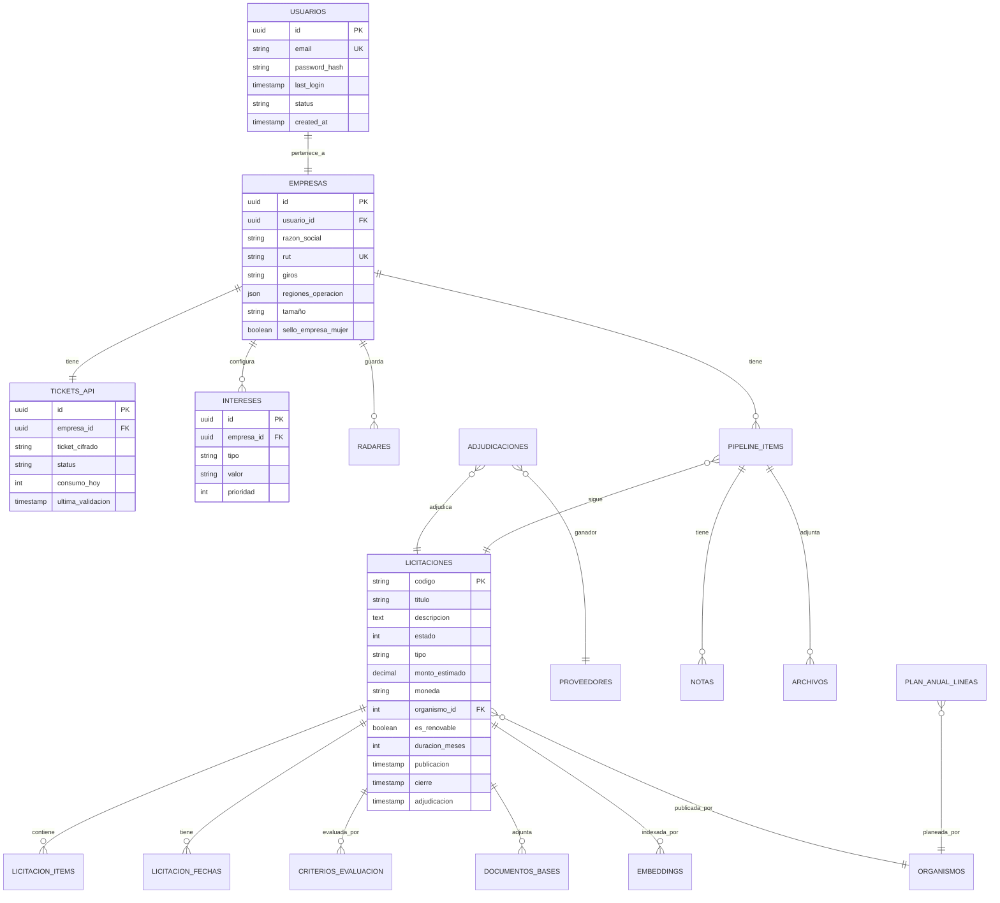

# Spec: Radar Público

> Plataforma de inteligencia comercial sobre Mercado Público de Chile para proveedores del Estado. Versión MVP (v1).

**Última actualización:** 2026-05-07
**Estado:** Borrador inicial para SDD
**Autor:** Equipo fundador

---

## 1. Resumen ejecutivo

### 1.1 Problema
Las empresas que venden al Estado chileno (vía Mercado Público) pierden oportunidades porque revisar manualmente la plataforma es lento, los filtros nativos son limitados, y la inteligencia de mercado (precios históricos, competencia, patrones) no está consolidada.

### 1.2 Solución
Una plataforma SaaS que sincroniza permanentemente con la API de Mercado Público y los Datos Abiertos de ChileCompra, aplica filtrado inteligente por intereses del proveedor, y entrega tres vistas operativas: análisis del pasado, monitoreo del presente y anticipación del futuro.

### 1.3 Usuarios objetivo
Empresas proveedoras del Estado de cualquier rubro, con cobertura nacional. Cada cuenta corresponde a una empresa (un usuario, un ticket de ChileCompra, un perfil de intereses).

### 1.4 Diferenciadores clave
- Filtrado multi-capa (UNSPSC estructurado + full-text + semántico).
- Vista de tres horizontes (pasado, presente, futuro) en navegación principal.
- Detección automática de oportunidades futuras vía patrones de renovación + Plan Anual.
- Chat con bases técnicas asistido por IA.
- Pipeline de seguimiento integrado.

### 1.5 Posicionamiento
Producto **horizontal**: cubre todos los rubros del catálogo UNSPSC. Cada cliente configura su nicho específico durante el onboarding. La diferenciación se da por usabilidad, profundidad de análisis y precio, no por especialización vertical.

### 1.6 Fuera de alcance (v1)
- Generación automática de propuesta técnica con IA (planeado v2).
- Multi-usuario por empresa (planeado v2).
- Postulación directa desde la plataforma (planeado v3).
- Aplicación móvil nativa (planeado v3).
- Integraciones con CRM/ERP de terceros.
- Self-service signup y pagos automatizados (las cuentas se aprovisionan manualmente).

---

## 2. Glosario

| Término | Definición |
|---|---|
| Licitación | Proceso de compra publicado por un organismo del Estado en Mercado Público. |
| OC | Orden de compra emitida tras una adjudicación o compra directa. |
| UNSPSC | United Nations Standard Products and Services Code. Estándar internacional de clasificación con 4 niveles: segmento, familia, clase, commodity. |
| Plan anual | Documento que cada organismo público publica con sus compras planificadas para el año. |
| Ticket | Token de acceso a la API de Mercado Público, único por persona, con cuota de 10.000 requests/día. |
| Radar | Búsqueda guardada del cliente con un set de filtros que dispara alertas cuando aparecen licitaciones que coinciden. |
| Rubro | Categoría de negocio del cliente, definida como combinación de rangos UNSPSC + keywords. |
| Score de relevancia | Puntaje 0-100 que el sistema asigna a cada licitación según el perfil del cliente. |

---

## 3. Roles y personas

### 3.1 Admin (operador del SaaS)
Es el dueño del producto. Recibe pagos por canal externo, aprovisiona cuentas, gestiona tickets de ChileCompra, supervisa el sistema. Tiene acceso a un panel de administración separado.

### 3.2 Proveedor (cliente final)
Empresa registrada en Mercado Público que paga por usar la plataforma. Ve solo lo que le compete a su empresa. No puede invitar otros usuarios ni asociar más de una empresa a su cuenta.

---

## 4. Epics y user stories

Las user stories siguen el formato: `Como [rol], quiero [acción], para [beneficio]`. Cada una incluye criterios de aceptación en formato Given/When/Then.

### Epic 1: Aprovisionamiento de cuentas (admin)

**US-1.1 — Crear cuenta de proveedor**
> Como admin, quiero crear cuentas nuevas para clientes que pagaron, para entregarles acceso al sistema.

Criterios de aceptación:
- Given que estoy en el panel admin, when ingreso email, RUT empresa, razón social y plan, then se crea la cuenta y se envía email al cliente con credenciales temporales.
- Given que creé una cuenta, when el cliente recibe el email, then debe poder iniciar sesión con la contraseña temporal y se le obliga a cambiarla en el primer login.
- Given que un email ya está registrado, when intento crear otra cuenta con ese email, then el sistema rechaza la operación con mensaje claro.

**US-1.2 — Suspender o eliminar cuenta**
> Como admin, quiero suspender o eliminar cuentas, para gestionar clientes morosos o que se dieron de baja.

Criterios:
- Suspender → el usuario no puede iniciar sesión pero sus datos se conservan 90 días.
- Eliminar → soft delete inicial; hard delete tras 90 días.

**US-1.3 — Cargar ticket de ChileCompra del cliente**
> Como admin, quiero cargar el ticket del cliente, para que el sistema pueda hacer consultas a la API en su nombre.

Criterios:
- Given que estoy en el detalle de un cliente, when ingreso el ticket en el campo correspondiente, then se cifra con AES-256 y se guarda en BD.
- El ticket nunca se muestra completo en la UI tras ser ingresado (solo últimos 4 caracteres).

**US-1.4 — Monitorear consumo de cuota por cliente**
> Como admin, quiero ver el consumo diario de cada ticket, para detectar saturación o anomalías.

Criterios:
- Dashboard admin muestra consumo de hoy, ayer, últimos 7 días por cada cliente.
- Alerta automática cuando un ticket supera 80% de cuota diaria.

### Epic 2: Autenticación

**US-2.1 — Login**
> Como proveedor, quiero iniciar sesión con email y contraseña, para acceder a mi cuenta.

Criterios:
- Given credenciales válidas, when hago login, then accedo al dashboard.
- Given email no registrado o contraseña incorrecta, when hago login, then el sistema responde "Credenciales inválidas" (mensaje único y genérico, sin distinguir cuál falló).
- Given cuenta suspendida, when hago login con credenciales válidas, then el sistema responde "Cuenta no disponible. Contacta a soporte" sin más detalle.
- Given 5 intentos fallidos en 15 minutos desde la misma IP, when intento de nuevo, then el sistema bloquea por 30 minutos.
- Sesión persistente vía JWT con expiración de 7 días, refresh token rotativo.

**US-2.2 — Logout**
> Como proveedor, quiero cerrar sesión, para proteger mi cuenta en computadores compartidos.

Criterios:
- Logout invalida el refresh token en servidor.
- Tokens existentes en otras pestañas siguen válidos hasta que expiren naturalmente.

**US-2.3 — Recuperar contraseña**
> Como proveedor, quiero recuperar mi contraseña si la olvidé, sin contactar a soporte.

Criterios:
- Solicitud de reset envía email con link único válido 30 minutos.
- El link funciona una sola vez.
- El sistema no revela si el email existe o no (responde igual ambos casos).

**US-2.4 — Cambiar contraseña**
> Como proveedor, quiero cambiar mi contraseña, para mantener la seguridad.

Criterios:
- Requiere ingresar la contraseña actual.
- Política de contraseña: mínimo 10 caracteres, al menos una mayúscula, una minúscula, un número.
- Tras cambio, se invalidan todas las sesiones existentes excepto la actual.

### Epic 3: Onboarding del proveedor

**US-3.1 — Wizard de configuración inicial**
> Como proveedor que entró por primera vez, quiero un wizard guiado, para configurar lo mínimo necesario antes de usar la plataforma.

Criterios:
- Given que es mi primer login, when accedo, then se muestra wizard obligatorio con pasos: empresa → ticket → intereses → notificaciones.
- No puedo acceder al dashboard hasta completar el wizard.
- Puedo guardar progreso parcial y continuar después.

**US-3.2 — Datos de la empresa**
> Como proveedor, quiero registrar los datos de mi empresa, para que el sistema personalice los resultados.

Datos a capturar:
- Razón social, RUT, giro/giros, tamaño (pyme, mediana, grande).
- Regiones donde opera (multi-select sobre las 16 regiones de Chile).
- Comunas donde opera (opcional).
- Año de fundación, equipo de profesionales aproximado.
- Sello Empresa Mujer (sí/no), inscripción en ChileProveedores (sí/no).

**US-3.3 — Validación e ingreso del ticket**
> Como proveedor, quiero que el sistema me guíe para conseguir mi ticket de ChileCompra y entregarlo a soporte, para que mi cuenta funcione.

Criterios:
- Pantalla con instrucciones paso a paso para obtener el ticket en api.mercadopublico.cl.
- Formulario para enviar el ticket a soporte (no se almacena en cliente).
- Mientras no se cargue el ticket, el dashboard muestra estado "Esperando activación" con instrucciones.
- Soporte (admin) recibe notificación cuando un cliente envía su ticket.

**US-3.4 — Definir intereses (rubros)**
> Como proveedor, quiero seleccionar los rubros que me interesan, para ver solo licitaciones relevantes.

Criterios:
- Selector jerárquico de UNSPSC: segmento → familia → clase. Puedo seleccionar a cualquier nivel.
- Permite agregar keywords personalizadas en lenguaje natural ("mantención CCTV", "soporte mesa de ayuda nivel 2").
- Permite agregar ejemplos: pegar URLs o códigos de licitaciones a las que postulé antes (el sistema aprende de esos ejemplos para mejorar el ranking).
- Mínimo 1 selección UNSPSC obligatoria para terminar el onboarding.

**US-3.5 — Configurar notificaciones**
> Como proveedor, quiero elegir cómo y cuándo recibir alertas, para no saturarme de información.

Criterios:
- Canales: email (siempre activo), WhatsApp (opcional, requiere número de teléfono validado vía OTP), in-app (siempre activo).
- Frecuencia de email: instantáneo, diario (resumen 8 AM), semanal (lunes 8 AM).
- Umbral de score: solo recibir alertas con score ≥ N (default 70).
- Tipos de eventos: nueva oportunidad, recordatorio de cierre, cambio de estado, adjudicación, oportunidad futura detectada.

### Epic 4: Dashboard

**US-4.1 — Vista resumen**
> Como proveedor, quiero un dashboard que me muestre lo más importante de un vistazo, para priorizar mi día.

Criterios:
- Tarjetas KPI arriba: oportunidades activas (cantidad), nuevas hoy, próximas a cerrar (24h), en pipeline.
- Lista de top 5 oportunidades del día por score, con CTA para ver detalle.
- Calendario semanal con cierres próximos.
- Acceso rápido a "Mis radares" guardados.

**US-4.2 — Gráfico de licitaciones por segmento**
> Como proveedor, quiero ver visualmente la distribución de licitaciones activas por segmento UNSPSC, para entender el panorama del día.

Criterios:
- Gráfico de barras horizontal o donut con segmentos UNSPSC y cantidad de licitaciones activas.
- Filtrable por: solo mis intereses / todos los segmentos.
- Click en un segmento → navega a búsqueda filtrada por ese segmento.

**US-4.3 — Indicador de salud del sistema**
> Como proveedor, quiero saber si el sistema está al día con la sincronización, para confiar en los datos.

Criterios:
- Indicador discreto: "Última sincronización: hace X minutos".
- Si ha pasado más de 1 hora sin sincronizar, alerta visible.

### Epic 5: Buscador y filtros

**US-5.1 — Búsqueda libre**
> Como proveedor, quiero buscar por texto libre, para encontrar licitaciones específicas rápidamente.

Criterios:
- Campo de búsqueda persistente arriba.
- Busca en título, descripción y nombre de organismo.
- Resultados ordenables por relevancia, fecha de cierre, monto.
- Resaltado de términos coincidentes.

**US-5.2 — Filtros estructurados**
> Como proveedor, quiero combinar filtros estructurados, para acotar la búsqueda.

Filtros disponibles:
- UNSPSC (multi-nivel)
- Estado: publicada, cerrada, adjudicada, desierta, suspendida
- Tipo de licitación: L1, LE, LP, LS, CO, AG (compra ágil), CM (convenio marco)
- Región del organismo (16 regiones)
- Comuna (cuando aplique)
- Rango de monto estimado
- Fecha de cierre: hoy, 24h, 48h, semana, mes, custom
- Organismo específico (autocomplete)
- Solo en mis intereses (toggle)

**US-5.3 — Búsquedas guardadas (radares)**
> Como proveedor, quiero guardar búsquedas que uso seguido, para recibir alertas cuando aparezcan coincidencias.

Criterios:
- Botón "Guardar como radar" tras configurar filtros.
- Cada radar tiene nombre, configuración de filtros y configuración de alertas (frecuencia, canal).
- Hasta 20 radares por cuenta.
- Lista de "Mis radares" en sidebar con conteo de coincidencias activas.
- Cada radar puede activarse/desactivarse sin eliminarlo.

**US-5.4 — Resultados paginados**
> Como proveedor, quiero ver los resultados ordenados y paginados, para navegarlos sin sobrecarga.

Criterios:
- 25 resultados por página, paginación clásica.
- Cada resultado muestra: título, organismo, monto, score, fecha de cierre, estado, badges (interés activo, ya postulé, etc.).
- Click → navega a vista de detalle.

### Epic 6: Detalle de licitación

**US-6.1 — Resumen de la licitación**
> Como proveedor, quiero un resumen ejecutivo de la licitación, para decidir rápido si me interesa.

Criterios:
- Header: código, título, organismo, estado, score con justificación.
- Información clave: monto estimado, modalidad, tipo, región, fechas críticas.
- Botón a Mercado Público (link directo).
- Acciones: marcar como interesado, descartar, agregar nota.

**US-6.2 — Bases y documentos**
> Como proveedor, quiero acceder a las bases técnicas y administrativas, sin salir de la plataforma.

Criterios:
- Lista de PDFs descargados con preview.
- Extracción automática de criterios de evaluación con sus ponderaciones (tabla).
- Extracción de requisitos técnicos y administrativos mínimos.
- Si la extracción IA tiene baja confianza, marcar visualmente y permitir revisar el PDF original.

**US-6.3 — Calendario de la licitación**
> Como proveedor, quiero ver todas las fechas relevantes en un calendario claro, para no perder plazos.

Criterios:
- Timeline visual con: publicación, preguntas (inicio/fin), respuestas, cierre, apertura técnica, apertura económica, adjudicación estimada.
- Cada fecha futura genera notificación automática (24h antes y 6h antes por defecto).

**US-6.4 — Inteligencia de la licitación**
> Como proveedor, quiero análisis contextual de la licitación, para tomar mejor decisión.

Criterios:
- Histórico del organismo: cuántas licitaciones similares ha hecho, a qué precios típicos.
- Competencia esperada: top proveedores que han ganado licitaciones similares (rango UNSPSC + organismo).
- Reputación del comprador: estadísticas de reclamos, atrasos en pago, declaraciones desiertas.
- Estimación de competitividad: alta / media / baja.

**US-6.5 — Chat con bases (asistente IA)**
> Como proveedor, quiero hacer preguntas en lenguaje natural sobre las bases, para entenderlas rápido.

Criterios:
- Chat lateral con contexto cargado de las bases.
- Preguntas frecuentes pre-cargadas como botones: "¿Pide boleta de garantía?", "¿Cuál es la experiencia mínima?", "¿Cómo se evalúa el precio?".
- Respuestas con citas a párrafos específicos del PDF original.
- Historial de conversaciones por licitación se conserva.
- Rate limit por cuenta: 100 mensajes/día (ajustable por plan).

### Epic 7: Vista pasado (análisis de mercado)

**US-7.1 — Análisis de mercado por rubro**
> Como proveedor, quiero estudiar el mercado de mi rubro en los últimos 24 meses, para tomar decisiones estratégicas.

Criterios:
- Filtros por UNSPSC, organismo, región, rango de fecha.
- Métricas: número de licitaciones, monto total adjudicado, tasa de adjudicación, tasa desierta, top compradores, top proveedores.
- Gráficos: tendencia mensual, distribución por organismo, distribución por monto.

**US-7.2 — Histórico de precios**
> Como proveedor, quiero ver a qué precios se han adjudicado servicios similares al mío, para definir mi estrategia de pricing.

Criterios:
- Búsqueda por keywords + UNSPSC.
- Tabla de adjudicaciones con: fecha, organismo, proveedor ganador, monto adjudicado, monto referencial, % de descuento.
- Estadísticas resumen: precio promedio, mediana, mínimo, máximo.

**US-7.3 — Análisis de competidor**
> Como proveedor, quiero ver qué ha ganado un competidor específico, para entender su estrategia.

Criterios:
- Buscador por RUT o razón social.
- Resultado: licitaciones adjudicadas, montos, organismos compradores recurrentes, rubros, evolución temporal.

### Epic 8: Vista presente (oportunidades activas)

**US-8.1 — Listado de oportunidades**
> Como proveedor, quiero ver todas las oportunidades activas que matchean mis intereses, para postular.

Criterios:
- Vista por defecto: oportunidades publicadas, ordenadas por score descendente.
- Filtros rápidos: solo cierran hoy, solo cierran esta semana, solo nuevas (últimas 24h).
- Acciones masivas: marcar varias como vistas, descartar varias.

**US-8.2 — Vista por radar**
> Como proveedor, quiero ver las oportunidades agrupadas por mis radares guardados, para revisarlos uno por uno.

Criterios:
- Tabs por cada radar activo, con conteo.
- Posibilidad de cambiar entre vista unificada y vista por radar.

### Epic 9: Vista futuro (anticipación)

**US-9.1 — Plan anual de compras**
> Como proveedor, quiero ver las compras planificadas por organismos en mis rubros, para preparar ofertas anticipadamente.

Criterios:
- Listado de líneas de plan anual filtradas por mis intereses.
- Cada línea muestra: organismo, descripción, mes estimado, monto estimado, estado (pendiente/publicada/adjudicada).
- Cuando una línea de plan anual se materializa en una licitación real, se marca y enlaza.

**US-9.2 — Renovaciones detectadas**
> Como proveedor, quiero ver contratos vigentes que están por vencer, para anticipar las relicitaciones.

Criterios:
- Sistema detecta contratos adjudicados con `EsRenovable=true` o con duración conocida cuya fecha estimada de término está dentro de los próximos 6 meses.
- Filtra por mis intereses.
- Cada renovación detectada muestra: licitación original, organismo, proveedor actual, monto adjudicado, fecha estimada de término, recomendación de cuándo prepararse.

**US-9.3 — Patrones estacionales**
> Como proveedor, quiero ver qué organismos suelen comprar mis rubros en qué meses, para preparar campañas de venta proactiva.

Criterios:
- Heatmap por organismo × mes mostrando frecuencia histórica de compras.
- Filtrado por UNSPSC.

### Epic 10: Pipeline de seguimiento

**US-10.1 — Estados del pipeline**
> Como proveedor, quiero clasificar mis licitaciones de interés en estados, para saber qué tengo que hacer.

Estados:
- `Nueva`: detectada por el sistema, no la he abierto.
- `Vista`: la abrí pero no decidí.
- `Interesado`: la marqué para postular.
- `Postulando`: estoy preparando la oferta.
- `Postulada`: ya envié.
- `Adjudicada`: gané.
- `Perdida`: no gané.
- `Descartada`: decidí no postular (con razón anotada).

Cada estado dispara comportamientos:
- `Interesado` → genera checklist de documentos automáticamente.
- `Postulando` → recordatorios diarios hasta postular o cierre.
- `Postulada` → seguimiento automático del estado en Mercado Público.
- `Adjudicada/Perdida` → análisis post-mortem si hay datos disponibles.

**US-10.2 — Vista pipeline**
> Como proveedor, quiero ver mi pipeline en formato Kanban o lista, para gestionar mi flujo.

Criterios:
- Toggle entre vista Kanban (columnas por estado) y vista lista (con columna de estado).
- Drag-and-drop para mover entre estados (en Kanban).
- Cada tarjeta muestra: título, organismo, monto, fecha de cierre, días restantes.

**US-10.3 — Notas y archivos por licitación**
> Como proveedor, quiero anotar comentarios y subir archivos relacionados a una licitación, para mantener todo en un solo lugar.

Criterios:
- Sección "Notas" con timestamp y autor.
- Subida de archivos hasta 25 MB cada uno, hasta 10 archivos por licitación.
- Solo el usuario dueño de la cuenta ve sus notas y archivos.

### Epic 11: Notificaciones

**US-11.1 — Notificaciones por email**
> Como proveedor, quiero recibir alertas por email, para enterarme de oportunidades sin tener que entrar a la plataforma.

Criterios:
- Eventos notificables: nueva oportunidad alta relevancia, recordatorio de cierre, cambio de estado de mis postulaciones, oportunidad futura detectada.
- Plantillas con branding del producto, link directo a la licitación.
- Footer con link para gestionar preferencias y opt-out parcial por tipo.

**US-11.2 — Notificaciones por WhatsApp**
> Como proveedor, quiero recibir alertas críticas por WhatsApp, para no perderme cierres inminentes.

Criterios:
- Solo eventos críticos: cierre inminente (6h antes), adjudicación de mis postulaciones, detección de oportunidad muy alta (score ≥ 90).
- Requiere número validado por OTP en onboarding.
- Posibilidad de pausar todas las notificaciones de WhatsApp por N días.

**US-11.3 — Centro de notificaciones in-app**
> Como proveedor, quiero ver el historial de notificaciones dentro de la app, para revisar lo que se me pasó.

Criterios:
- Icono de campana en el header con badge de no leídas.
- Listado de últimas 100 notificaciones con timestamp, tipo, link.
- Marcar como leído individual o todas.

### Epic 12: Configuración

**US-12.1 — Editar perfil de empresa**
> Como proveedor, quiero editar los datos de mi empresa, para mantenerlos actualizados.

Criterios: edita los mismos campos que en el onboarding.

**US-12.2 — Editar intereses y radares**
> Como proveedor, quiero modificar mis rubros y radares cuando cambie mi negocio.

Criterios: edición libre de los UNSPSC, keywords, ejemplos. Cambios surten efecto en próxima sincronización.

**US-12.3 — Estado del ticket de ChileCompra**
> Como proveedor, quiero saber el estado de mi ticket y solicitar renovación si tiene problemas.

Criterios:
- Vista que muestra: estado (activo/error), fecha de carga, consumo del día.
- Botón "Reportar problema con el ticket" → notifica a soporte.

**US-12.4 — Cambiar contraseña** (ya cubierto en US-2.4)

**US-12.5 — Preferencias de notificaciones** (igual que US-3.5 pero editable)

---

## 5. Modelo de datos

Diagrama ER simplificado de las entidades principales (notación Mermaid):



Tablas adicionales fuera del diagrama por simplicidad:
- `NOTIFICACIONES` (cola de envío y log).
- `EVENTOS_AUDITORIA` (todas las acciones de admin y de usuarios).
- `API_QUOTA_LOG` (cada llamada a la API de Mercado Público con ticket, IP, status).
- `LLM_USAGE_LOG` (consumo de tokens por cliente para cuotas y costos).

---

## 6. Arquitectura técnica

### 6.1 Stack
- **Frontend:** Next.js 15 + TypeScript + TailwindCSS + shadcn/ui + TanStack Query + Zustand. Responsive mobile-first. PWA habilitada.
- **Backend:** FastAPI (Python 3.12) + Pydantic. API REST con OpenAPI auto-generado.
- **Base de datos:** PostgreSQL 16 + extensión pgvector. Redis para cache y colas.
- **Workers:** Celery + Celery Beat para tareas programadas.
- **Storage de archivos:** Cloudflare R2 (PDFs de bases, archivos del cliente).
- **Auth:** Clerk o Auth.js (a decidir; ambos compatibles con el flow invite-only).
- **Notificaciones:** Resend (email), Twilio o 360Dialog (WhatsApp Business API).
- **Observabilidad:** Sentry (errores), PostHog (producto), Better Stack o Grafana (logs e infra).
- **Hosting:** Vercel (frontend), Railway o Fly.io (backend + workers), Neon o Supabase (Postgres administrado).

### 6.2 Capa de abstracción LLM (requisito crítico)

El sistema debe ser agnóstico al proveedor de IA. Implementación:

```python
# Pseudocódigo de la interfaz
class LLMProvider(Protocol):
    async def complete(prompt: str, **opts) -> Response: ...
    async def chat(messages: list[Message], **opts) -> Response: ...
    async def embed(text: str) -> list[float]: ...

class AnthropicProvider(LLMProvider): ...
class GoogleProvider(LLMProvider): ...
class OpenAIProvider(LLMProvider): ...

class LLMRouter:
    """Selecciona provider según contexto: tarea, presupuesto, latencia."""
    def for_task(task_type: str) -> LLMProvider: ...
```

Decisión: usar **LiteLLM** como librería base por defecto (ya implementa esta abstracción, soporta 100+ proveedores y maneja retries, fallbacks, rate limits). Wrap dentro de nuestra propia interfaz para poder reemplazarla si en el futuro la migración requiere mayor control.

Configuración de provider por tarea:
- `task: bases_chat` → Claude Sonnet (calidad de razonamiento).
- `task: clasificacion_corta` → modelo más barato del provider activo.
- `task: embeddings` → Voyage AI (default) o el embedder del provider activo.

Cambio de provider se hace por configuración en `.env`, sin tocar código de aplicación.

### 6.3 Sincronización con API Mercado Público
- Ver detalle en sección de patrón de dos pasos. Workers separados para listado, detalle, scrapping de PDFs y procesamiento.
- Backfill inicial desde Datos Abiertos (CSVs) para 24 meses históricos.
- Sincronización incremental cada 15 minutos en horario diurno, cada 5 minutos los últimos 60 minutos antes del cierre de la jornada (alta densidad de publicaciones).
- Bulk loads y reprocesamientos en horario nocturno (22:00–07:00).

### 6.4 Procesamiento de PDFs y embeddings
- Parser: pymupdf como primario, unstructured.io como fallback para PDFs complejos.
- Chunking semántico con overlap.
- Embeddings: Voyage AI (`voyage-3-large` o equivalente al momento de implementar).
- Indexación en pgvector con índice HNSW.

---

## 7. Requisitos no-funcionales

### 7.1 Performance
- Tiempo de respuesta del dashboard: < 2 segundos en p95.
- Tiempo de respuesta de búsqueda: < 1 segundo en p95.
- Latencia de chat IA: streaming, primer token < 2 segundos.
- Sincronización de licitaciones nuevas: nueva licitación visible en máximo 30 minutos desde su publicación en Mercado Público.

### 7.2 Seguridad
- Cifrado en tránsito: HTTPS only, TLS 1.3.
- Cifrado en reposo: BD cifrada, tickets de ChileCompra cifrados con AES-256 en columna específica.
- Autenticación: bcrypt para password hashing (cost factor 12).
- Rate limiting global: 100 req/min por IP, 1000 req/min por usuario.
- Headers de seguridad: CSP, HSTS, X-Frame-Options, X-Content-Type-Options.
- Logs de auditoría para todas las acciones de admin y eventos sensibles.
- Sin información personal en logs ni en errores enviados a Sentry.

### 7.3 Disponibilidad y respaldo
- SLA objetivo: 99.5% uptime mensual.
- Backups: diarios automáticos, retención 30 días, prueba de restore mensual.
- RTO 4 horas, RPO 24 horas.

### 7.4 Cumplimiento legal
- Ley 19.628 sobre Protección de la Vida Privada (Chile): consentimiento explícito en onboarding, política de privacidad publicada, derecho a eliminación.
- Ley 20.575 sobre derecho a olvido en datos personales.
- Términos de uso explícitos sobre el uso de la información de Mercado Público (la API es gratuita pero exige citar fuente).

### 7.5 Escalabilidad
- Diseño para 100 clientes concurrentes en v1, 1.000 en v2.
- Horizontal scaling: workers de Celery escalables independientemente del API.
- Postgres: lectura desde réplica para queries pesadas (pasado, analytics).

---

## 8. Roadmap por fases

### v1 — MVP (3-4 meses)
Cubre todos los Epics 1 al 12 de este spec. Lanzamiento a primeros clientes (3-5).

### v2 — Diferenciación (meses 5-9)
- Generación automática de borrador de propuesta técnica.
- Multi-usuario por empresa con roles (admin de empresa, editor, lector).
- Análisis post-mortem automatizado al perder licitaciones.
- Integraciones: WhatsApp Business avanzado, exportación a Google Drive.
- API pública para clientes que quieran integrar a su propio CRM.

### v3 — Expansión (meses 10-15)
- Postulación directa desde la plataforma.
- Aplicación móvil nativa (iOS, Android).
- Marketplace de UTPs (Uniones Temporales de Proveedores).
- Inteligencia conversacional avanzada (asistente que recuerda contexto del cliente).

---

## 9. Métricas de éxito

### 9.1 Métricas de producto
- Activación: % de cuentas que completan onboarding en 7 días.
- Retención: cuentas activas a 30, 60, 90 días.
- Engagement: licitaciones marcadas como interés / cuenta / mes.
- Adopción: número de radares activos por cuenta.
- IA: mensajes de chat con bases por cuenta / mes.

### 9.2 Métricas de negocio (cliente)
- Tasa de adjudicación de los clientes (líneas postuladas vs ganadas), comparada con promedio nacional.
- Número de oportunidades detectadas por cliente / mes.
- Time-to-decision: tiempo entre que aparece una licitación y el cliente la marca como interés.

### 9.3 Métricas técnicas
- Latencia p95 de queries.
- Tasa de error.
- Consumo de cuota API por cliente.
- Costo de IA por cliente / mes.

---

## 10. Decisiones abiertas y supuestos

Esta sección lista decisiones técnicas o de producto que aún no están cerradas y que deben resolverse antes o durante implementación.

1. **Auth provider:** Clerk vs Auth.js. Clerk es más rápido de integrar; Auth.js da más control y es gratuito.
2. **Hosting de Postgres:** Neon (serverless, escala a 0) vs Supabase (más completo). Recomendación: Neon en MVP por costos.
3. **Pricing al cliente:** no definido en este spec (queda fuera de alcance técnico).
4. **Política de retención de archivos del cliente:** ¿cuánto tiempo se conservan los PDFs subidos por el cliente? Sugerencia: mientras la licitación esté activa + 12 meses post-adjudicación.
5. **Detalle del flow de pago:** confirmamos que es manual fuera de la plataforma. ¿Necesitamos generar facturas automáticamente desde la plataforma o eso lo manejas externamente?

---

## Anexos

### Anexo A — Códigos de estado de licitación

| Código | Estado |
|---|---|
| 5 | Publicada |
| 6 | Cerrada |
| 7 | Desierta |
| 8 | Adjudicada |
| 18 | Revocada |
| 19 | Suspendida |

### Anexo B — Tipos de licitación

L1, LE, LP, LS, A1, B1, J1, F1, E1, CO, B2, A2, D1, E2, C2, C1, F2, F3, G2, G1, R1, CA, SE.
(Ver documentación oficial de Mercado Público para detalle completo).

### Anexo C — Variables de entorno requeridas (referencia)

```
DATABASE_URL=...
REDIS_URL=...
ANTHROPIC_API_KEY=...
VOYAGE_API_KEY=...
LLM_PROVIDER=anthropic   # anthropic | google | openai
LLM_MODEL_REASONING=...
LLM_MODEL_FAST=...
RESEND_API_KEY=...
WHATSAPP_PROVIDER_API_KEY=...
R2_ACCESS_KEY=...
R2_SECRET_KEY=...
R2_BUCKET=...
SENTRY_DSN=...
JWT_SECRET=...
ENCRYPTION_KEY=...   # para tickets ChileCompra
```

---

*Fin del documento. Este spec es un documento vivo y debe versionarse en el repositorio.*
